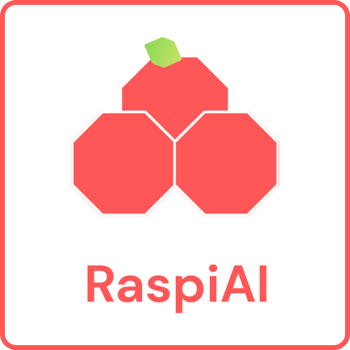

  <h1 align="center">
    
  

  <a align="center">
    

## Introduction

RaspiAI is a platform that lets you add AI agents to any website **for free** — no hidden subscriptions, and mostly watermark-free.  

- **Easy to Use**  
  Just go to [raspiai.cattymod.app](https://raspiai.cattymod.app), create an embed, and add it to your site. No login or signup required.  

- **Customizable**  
  Configure your AI agents to behave exactly how you want, with flexible options for appearance and functionality.  

- **Open & Free**  
  All core features are completely free to use, making it accessible for anyone.  

## Try it Now

Click below to get started instantly:  

[Try RaspiAI](https://raspiai.cattymod.app)

## License

RaspiAI is [MIT licensed](./LICENSE).
